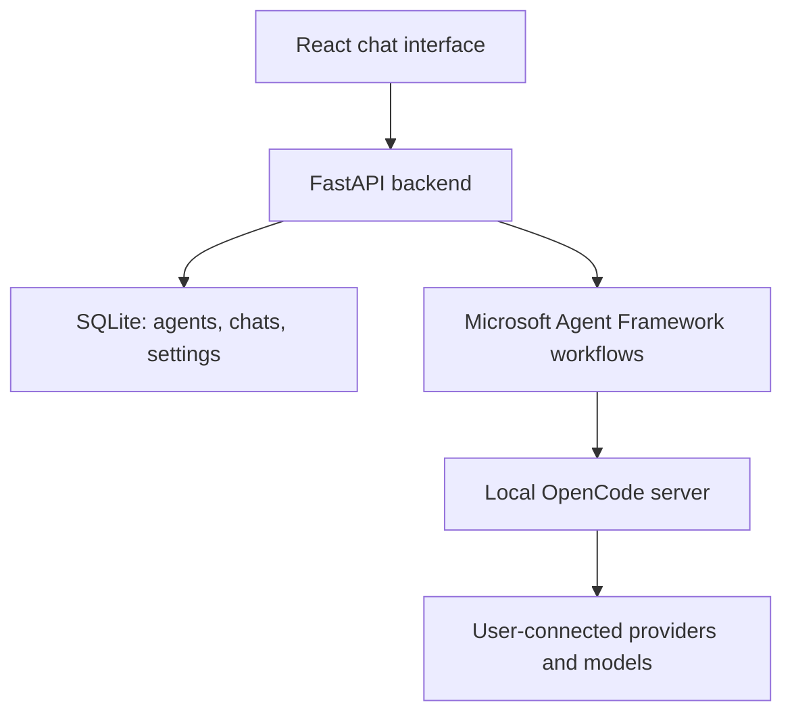

# SmartRail Agents: configurable local chat platform

## 1. Summary and defaults

Build a simple browser app for creating AI agents, chatting with them individually, and starting discussions between selected agents. It runs locally on macOS and native Windows.

- Users can create any number of agents and choose each agent’s provider, model, and persona.
- Providers and models come from the user’s OpenCode installation.
- Provider authentication stays in OpenCode.
- The ten assessment roles become optional starter templates.
- Agents can reuse the same model.
- The default coordinator uses GPT-6-sol through your Codex subscription; its configuration is editable.
- Microsoft Agent Framework coordinates discussions, while OpenCode executes model requests.
- Chats persist locally. Markdown transcripts are generated only through an explicit export request.
- Development uses incremental commits and parallel feature agents in separate Git worktrees.

Keep the product focused on chat. No deployment, dashboards, or document-management features.

**Amendment (file tools).** Each agent may have a *working directory* and a *tool access* level:
`none` (default, text only), `read_only` (read/list/glob/grep) or `read_write` (also create and
edit files). Tools are confined to the agent's working directory; shell, web, MCP and delegation
tools stay denied at every level. Users attach files from a participant's working directory to a
message with `@`; their text is sent with the message. Agent messages record the tool calls made
(shown in the transcript, never re-run).

## 2. Architecture and data



**Stack:** React, TypeScript, Vite, Tailwind, a few shadcn/ui components; Python 3.12, FastAPI, Pydantic, HTTPX, aiosqlite, and Microsoft Agent Framework. Pin dependencies and commit lockfiles.

Implement a custom Agent Framework `OpenCodeExecutor`. It supplies the selected model and persona to OpenCode, streams responses, and supports cancellation. Framework executors support this integration pattern. [Microsoft executor documentation](https://learn.microsoft.com/en-us/agent-framework/concepts/workflows/executors)

Use **one neutral, tool-disabled OpenCode runtime agent** rather than generating an OpenCode configuration for every user-created agent. Agent definitions live in SQLite; OpenCode accepts per-request model selection and system instructions. [Pinned OpenCode prompt implementation](https://github.com/anomalyco/opencode/blob/v1.18.22/packages/opencode/src/session/prompt.ts)

Saved agents are lightweight definitions. Creating an agent does not start another server process.

**Core records**

- `Agent`: stable ID, name, persona instructions, provider ID, model ID, revision, archived state, timestamps.
- `Conversation`: direct/group type, participant IDs, title, timestamps.
- `Message`: speaker name and agent revision snapshot, actual provider/model, content, status, timestamp, optional reply target.
- `Run`: conversation, participant configuration snapshots, execution status, OpenCode session mappings, usage.
- `Settings`: shared project brief, coordinator agent ID, OpenRouter budget.

Configuration edits apply to the next run. An active discussion keeps its starting configuration. Historical messages retain their original speaker and model details.

**Application interfaces**

| Interface | Purpose |
|---|---|
| `GET/POST /api/agents` | List and create agents |
| `PATCH /api/agents/{id}` | Edit or archive an agent |
| `GET /api/providers` | Discover OpenCode providers and models; support explicit refresh |
| `GET/POST /api/conversations` | List and create chats |
| `GET /api/conversations/{id}` | Load a transcript |
| `POST /api/conversations/{id}/messages` | Submit a message; return a run ID |
| `GET /api/runs/{id}/events` | Stream responses and status through SSE |
| `POST /api/runs/{id}/stop` | Cancel execution |
| `GET/PATCH /api/settings` | Read and update settings |
| `GET /api/conversations/{id}/export` | Download the requested Markdown transcript |

Define these contracts before parallel implementation. Generate frontend types from the backend schema.

## 3. Interface and conversation behaviour

**Main screen**

- Sidebar with agents, saved discussions, **New agent**, and **New discussion**.
- Main chat area with speaker labels, streaming responses, and a composer.
- Stop button during generation.
- Small settings dialog and a conversation menu containing Export transcript.

**Agent creation**

Use a compact dialog with four fields:

1. Name.
2. Persona instructions.
3. Provider.
4. Model.

An optional template selector fills the name and persona. Include Passenger, Driver, Station manager, Railway controller, Customer-service representative, Catering provider, Security engineer, QA engineer, Accessibility specialist, and Product owner.

The provider/model picker is searchable and uses OpenCode’s catalog. Show connected providers and model prices when available. Users connect additional providers in OpenCode, then click Refresh in this app. OpenCode exposes provider discovery and connected-provider information. [OpenCode server API](https://opencode.ai/docs/server/)

Support editing and archiving. Archived agents disappear from new-discussion selection while their existing transcripts remain readable.

**Direct chats**

Each direct conversation has its own OpenCode session. Sending a message invokes only the selected agent.

Maintain a shared project-brief text field for the assessment specification and current project description. Make the latest brief available to every agent. Private conversations remain separate.

**Group discussions**

Users select two or more agents and provide a topic. There is no fixed participant-count limit.

Each explicitly started exchange follows:

1. Coordinator introduces a short agenda.
2. Every selected participant contributes.
3. Every participant responds to another participant’s first-round contribution.
4. Coordinator summarizes agreements, disagreements, and unanswered questions.

Use deterministic speaker order and two rounds. Participants receive the shared discussion, so their replies address one another rather than producing isolated answers.

Execute turns sequentially, with one active run at a time. Agent count remains unrestricted; runtime activity is bounded by the discussion sequence, budget, and Stop button.

Follow-up messages start another bounded exchange. Nothing runs in the background.

**Persistence and errors**

Preserve full visible transcripts in SQLite and use OpenCode session history/compaction for continued conversations.

On cancellation or failure, retain completed messages and mark unfinished responses appropriately. Reconnecting the interface must not repeat model requests.

If a chosen model becomes unavailable, provide an action to edit the agent. Do not silently change its provider or model.

## 4. Local portability, authentication, and costs

**Cross-platform execution**

Support native Windows directly. WSL is optional; OpenCode documents both native installation and WSL usage. [OpenCode installation](https://opencode.ai/docs/), [Windows guidance](https://opencode.ai/docs/windows-wsl/)

Use the same setup commands in PowerShell and a macOS terminal:

```text
uv sync --frozen
npm ci
npm run build
uv run smartrail
```

Prerequisites are Git, uv, Node.js, and OpenCode. uv manages the pinned Python version.

The Python launcher will:

- Resolve executables correctly, including Windows `.exe` and `.cmd` wrappers.
- Start an app-managed OpenCode server using argument arrays.
- Bind both services to loopback and protect OpenCode with a generated password.
- Wait for server readiness before opening the browser.
- Clean up its child processes when stopped.
- Report missing dependencies and occupied ports clearly.

Use `pathlib` and `platformdirs`. Store databases, runtime configuration, and logs in the user’s application-data directory, outside the checkout. Provide `SMARTRAIL_DATA_DIR` and port overrides for isolated tests and worktree development.

Serve the built frontend through FastAPI, giving normal use one local URL.

**Authentication**

Reuse OpenCode connections without copying credentials into application storage. Initial setup connects OpenAI using ChatGPT sign-in and verifies GPT-6-sol availability. OpenCode documents this subscription authentication option. [OpenCode providers](https://opencode.ai/docs/providers/#openai)

Keep the runtime persona conversational and deny shell, web, MCP, and native delegation tools. File tools are available only per the agent's tool access level, inside its working directory.

**Spending**

Retain the agreed $5 monthly OpenRouter budget:

- Check estimated remaining budget before each OpenRouter request.
- Default participant output limits to 1,024 tokens and coordinator limits to 2,048.
- Track OpenRouter spending separately from subscription usage.
- Configure the OpenRouter key’s monthly limit for a provider-enforced ceiling. [OpenRouter credit limits](https://openrouter.ai/docs/api_reference/limits)
- Pause when the budget or coordinator allowance is exhausted.

Display other providers’ prices when supplied by OpenCode. Their billing limits remain managed through those providers; the OpenRouter limit does not cover them.

## 5. Git workflow, implementation order, and acceptance

**Foundation**

When implementation begins, initialize a local Git repository on `main`. Commit the scaffold, dependency locks, API contracts, ignore rules, and development instructions before feature work starts.

Ignore credentials, runtime data, databases, build output, and local environments.

**Parallel feature development**

Create three feature branches and separate Git worktrees from the foundation commit:

| Development agent | Exclusive ownership |
|---|---|
| Runtime agent | `backend/runtime/`: OpenCode adapter, catalog discovery, sessions, streaming, cancellation |
| Application agent | `backend/application/`: agent registry, SQLite persistence, API routes, Agent Framework discussions, budget handling |
| Frontend agent | `frontend/`: chat UI, agent editor, model picker, groups, settings, export controls |

The coordinating development agent owns shared contracts, dependency manifests, the cross-platform launcher, CI configuration, and integration.

Each worker uses separate ports and data directories, tests against the agreed interfaces, and commits small completed changes. Workers do not modify shared authentication or another worker’s files.

The coordinator reviews and merges branches into `main`, runs integration checks after each merge, and commits any necessary corrections. Remove worktrees after their changes are integrated and preserved.

**Delivery checkpoints**

1. Verify one subscription-backed coordinator call and one OpenRouter call through Agent Framework.
2. Complete persistent direct chats and dynamic agent creation.
3. Complete manually started group discussions and cancellation.
4. Finish cross-platform startup, budget controls, requested exports, and integration tests.

**Acceptance tests**

- Create more than ten agents and assign shared or different models.
- Select models from multiple connected providers.
- Edit an agent during a run without changing that run’s configuration.
- Preserve historical labels after renaming, model changes, or archiving.
- Run a group larger than ten participants using a mocked runtime; verify both rounds and peer replies.
- Preserve chats across application restarts.
- Reconnect streaming without duplicate messages or requests.
- Stop execution before subsequent participants run.
- Handle disconnected providers, unavailable models, rate limits, and exhausted budgets.
- Complete a fresh-clone setup on macOS and native Windows, including paths containing spaces.
- Verify launcher readiness and process cleanup on both operating systems.
- Generate Markdown only when Export transcript is requested.

Use mocked OpenCode responses for automated tests and live smoke tests for authentication and model routing. Windows support must be verified on Windows; macOS results alone are insufficient.
